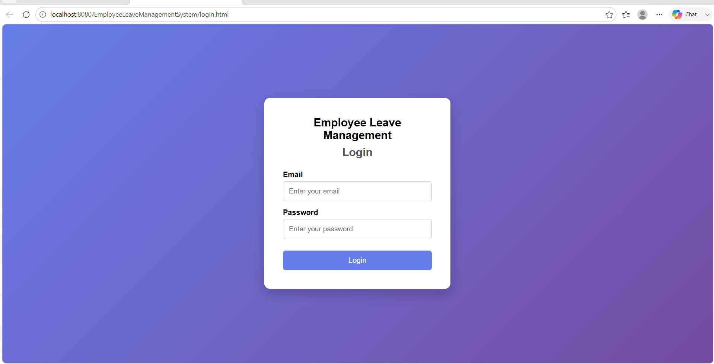
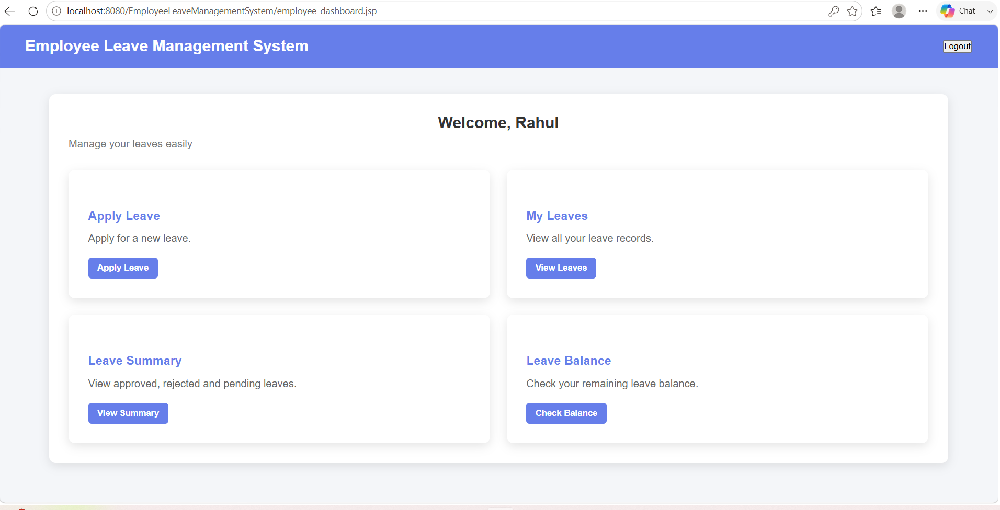
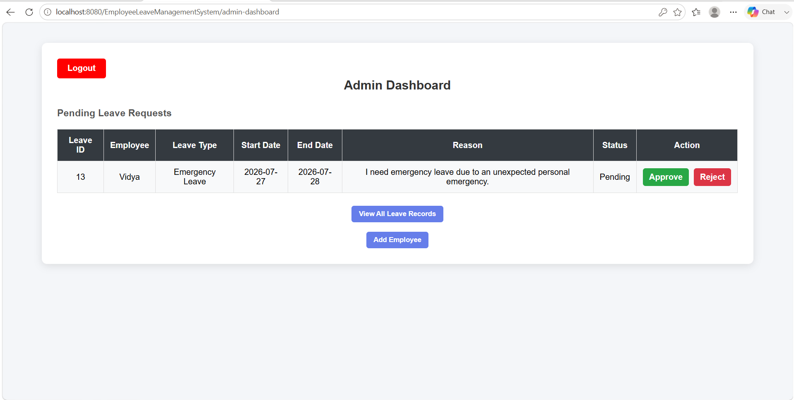
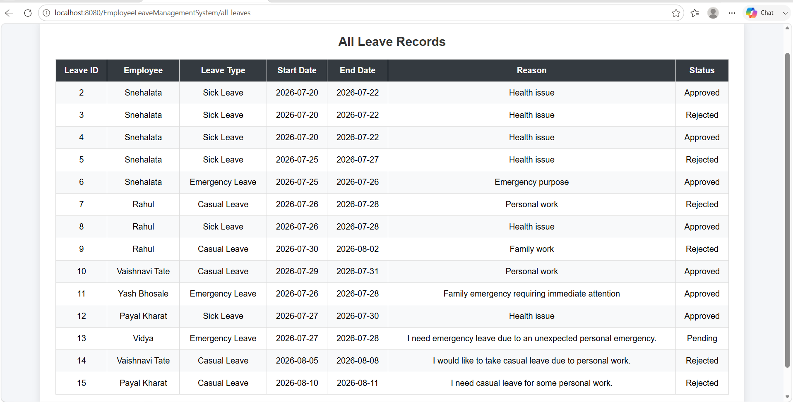

# Employee Leave Management System

A web-based Employee Leave Management System developed using Java, JSP, Servlets, Hibernate and MySQL. The system allows employees to apply for leave, track leave status, and check leave balance, while administrators can manage employees and approve or reject leave requests.

## Features

### Employee
- Secure Login
- Apply for Leave
- View Leave History
- Check Leave Balance
- View Leave Summary
- Logout

### Admin
- Secure Login
- View Pending Leave Requests
- Approve Leave
- Reject Leave
- Add Employee
- View All Leave Records
- Logout

##  Technologies Used

- Java
- JSP
- Servlets
- Hibernate
- Maven
- MySQL
- HTML
- CSS
- Apache Tomcat

##  Project Structure

```
EmployeeLeaveManagementSystem
│── src
│   ├── main
│   │   ├── java
│   │   ├── resources
│   │   └── webapp
```

##  Database

- MySQL
- Hibernate ORM
- JDBC Driver

##  Setup

1. Clone the repository.
2. Import the project into Eclipse as a Maven Project.
3. Configure the MySQL database.
4. Update database credentials in the Hibernate configuration file.
5. Run the project on Apache Tomcat.
6. Open in your browser.

## Modules

- Login
- Employee Dashboard
- Admin Dashboard
- Apply Leave
- Leave Summary
- Leave Balance
- View Leave Records
- Add Employee

## Screenshots

### Employee Login


### Employee Dashboard


### Admin Dashboard


### Leave Records


##  Developed By

**Snehalata Tate**


